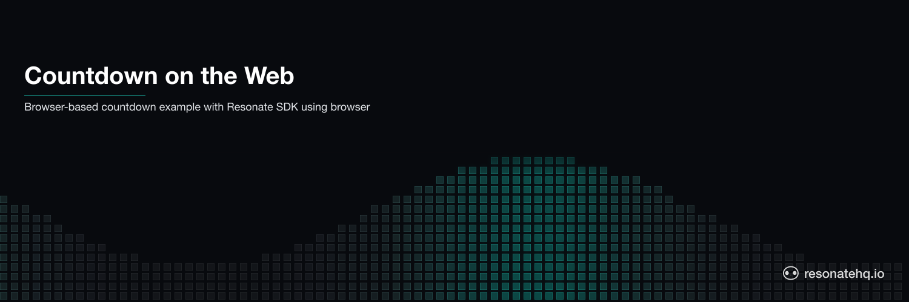
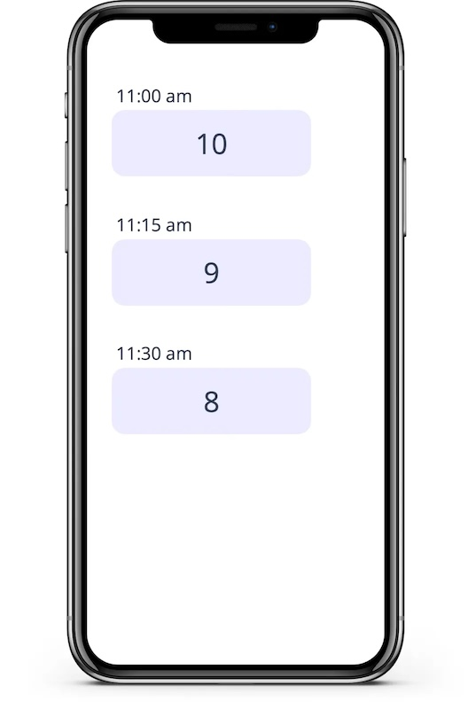
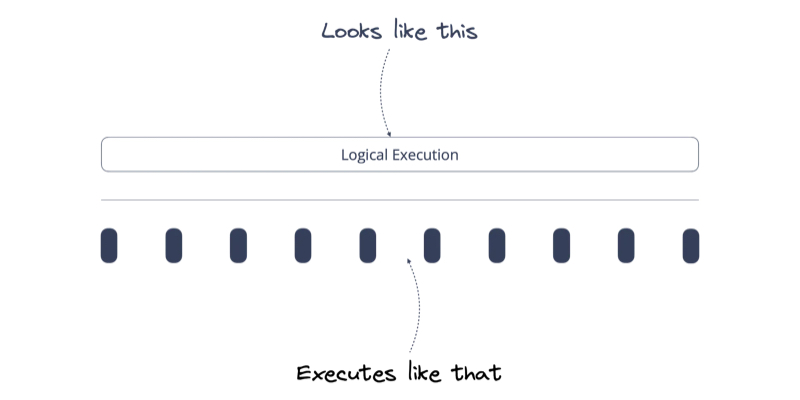

<p align="center">
  <picture>
    <source media="(prefers-color-scheme: dark)" srcset="./assets/banner-dark.png">
    <source media="(prefers-color-scheme: light)" srcset="./assets/banner-light.png">
    
  </picture>
</p>

# Resonate Countdown in the Browser

A *Countdown* powered by the Resonate Typescript SDK and running in the browser. The countdown sends periodic browser notifications at configurable intervals.

<div align="center">
  
</div>

## Behind the Scenes

The Countdown is implemented with Resonate's Durable Execution framework, Distributed Async Await. The Countdown is a simple loop that can sleep for hours, days, or weeks. On `yield ctx.sleep` the countdown function suspends, and after the specified delay, Resonate will resume the countdown function.

```typescript
export function* countdown(ctx: Context, count: number, delay: number) {
  for (let i = count; i > 0; i--) {
    // send browser notification
    yield* ctx.run(notify, `Countdown: ${i}`);
    // sleep (delay is in minutes)
    yield* ctx.sleep(delay * 60 * 1000);
  }
  // send the last notification
  yield* ctx.run(notify, `Done`);
}
```

**Key Concepts:**

- **Suspension and Resumption:** Executions can be suspended for any amount of time
- **Durable execution in the browser:** The browser tab acts as a worker, executing steps of a long-lived execution coordinated by the Resonate Server.

<div align="center">
  
</div>

---

# Running the Example

## 1. Prerequisites

Install the Resonate Server & CLI with [Homebrew](https://docs.resonatehq.io/operate/run-server#install-with-homebrew) or download the latest release from [Github](https://github.com/resonatehq/resonate/releases).

```
brew install resonatehq/tap/resonate
```

## 2. Start Resonate Server

Start the Resonate Server. By default, the Resonate Server will listen at `http://localhost:8001`.

```
resonate dev --api-http-cors-allow-origin http://localhost:5173
```

## 3. Setup the Countdown

Clone the repository

```
git clone https://github.com/resonatehq-examples/example-countdown-web-ts
cd example-countdown-web-ts
```

Install dependencies

```
npm install
```

## 4. Start the Countdown

Start the web application. By default, the web application will listen at `http://localhost:5173`.

```
npm run dev
```

Open `http://localhost:5173` in your browser.

## 5. Invoke the Countdown

Start a countdown

```
resonate invoke <promise-id> --func countdown --arg <count> --arg <delay-in-minutes>
```

Example

```
resonate invoke countdown.1 --func countdown --arg 5 --arg 1
```

## 6. Inspect the execution

Use the `resonate tree` command to visualize the countdown execution.

```
resonate tree countdown.1
```

Example output (while waiting on the second sleep):

```
countdown.1
├── countdown.1.0 🟢 (run)
├── countdown.1.1 🟢 (sleep)
├── countdown.1.2 🟢 (run)
└── countdown.1.3 🟡 (sleep)
```

## Troubleshooting

If everything is configured correctly, you will see browser notifications appear.

If you are still having trouble please [open an issue](https://github.com/resonatehq-examples/example-countdown-web-ts/issues).
